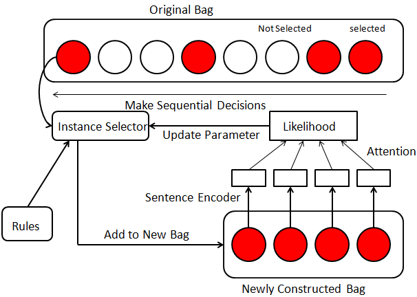

Source code for [Posterior regularized REINFORCE for Instance Selection in Distant Supervision] (https://arxiv.org/abs/1904.08051)

<p align="center"></p>
--------------------------------------------------------------------------------


# Environment
Python 2.7
Tensorflow 1.5.0

# Preparing for Training
 include NYT dataset, rule pattern txt in the ./origin_data folder.

 change current dir into ./origin_data , generate the data for transE prediction. Generated by:

```
python generate_transE.py
```

Then run the trained TransX model to generate the entity vector file ./data/entity2vec.bern

change current dir into ./initial_data ,  generate the data for  training and testing. Generated by:

```
python initial_BGRU_traintest.py
python initial.py
python initial_train_robot.py
```

# Train and Test demo
A demo for train and test is provided and can be execurated by:
```
python launcher.py
```

